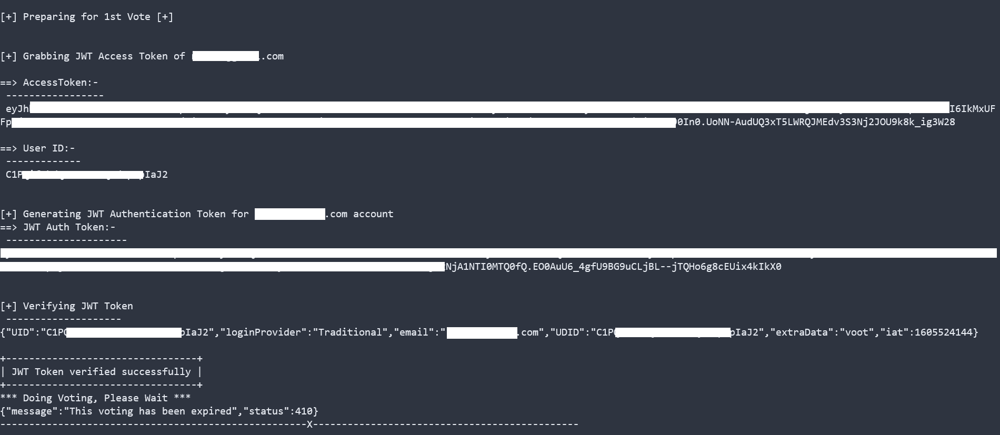

## What it is?
A script to automate the process of Voting for Bigg Boss contestants.



## 😕 How it works?
This script uses Voot accounts which are already created in bulk and login into each one of them which then extracts userId, Access Token, Authentication Token, and also verifies JWT Token. If everything is correct and is in place, it executes the API endpoint which is responsible for a vote to register.

## 💻 Configuration:-
Before you start using this script, you need to configure two variables **contestantId** and **contestantName** in an API endpoint (https://voting-api.voot.com/v1/addvote) to point out who you want to vote. You can grab these two variables by log in to https://voting.voot.com/vote/ec324230-02f2-11eb-bf8c-d128fef771cc and inspect element the particular contestant to find out their **contestantId** and **contestantName**.

## 🤖 Run:-
```
$ git clone https://github.com/iamnihal/voot.git
$ cd voot
$ chmod +x BigBoss14.sh
$ ./BigBoss14.sh
```

## 📝 Note:-
Currently, I have redacted the password from the file for obvious reason. So it won't work as of now. Alternatively, you can create your own accounts and start using it on the script. Keep in mind that you can vote only one time with an account for the specific week's nomination.

## 🚀 TODO:-
* To add a feature that creates accounts in bulk.

## Caution:-
I don't know if this thing is legal or not. I've read the Terms & Conditions of voot.com and I didn't find anything which could potentially indicate this script as illegal to use.
